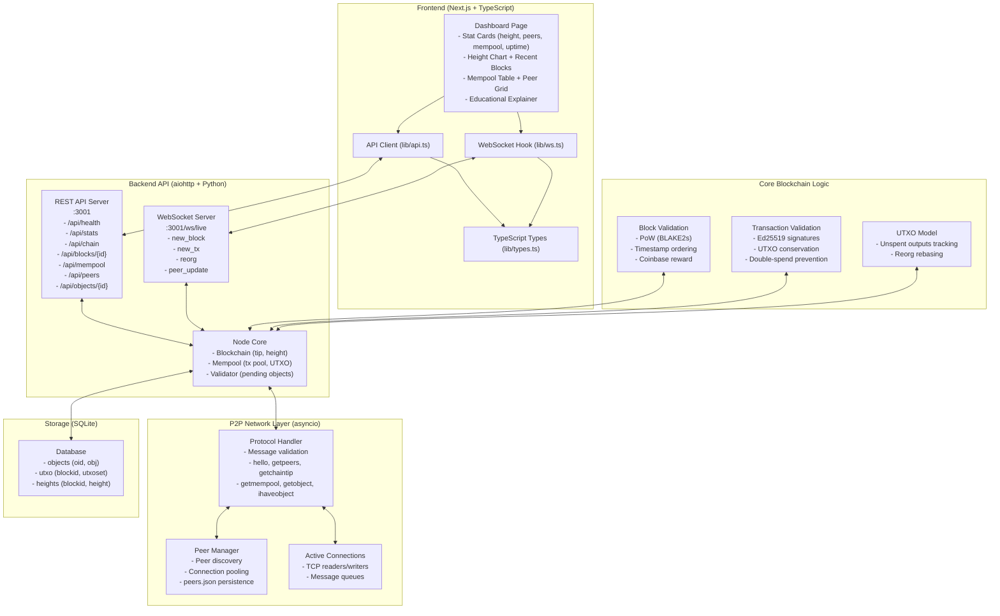
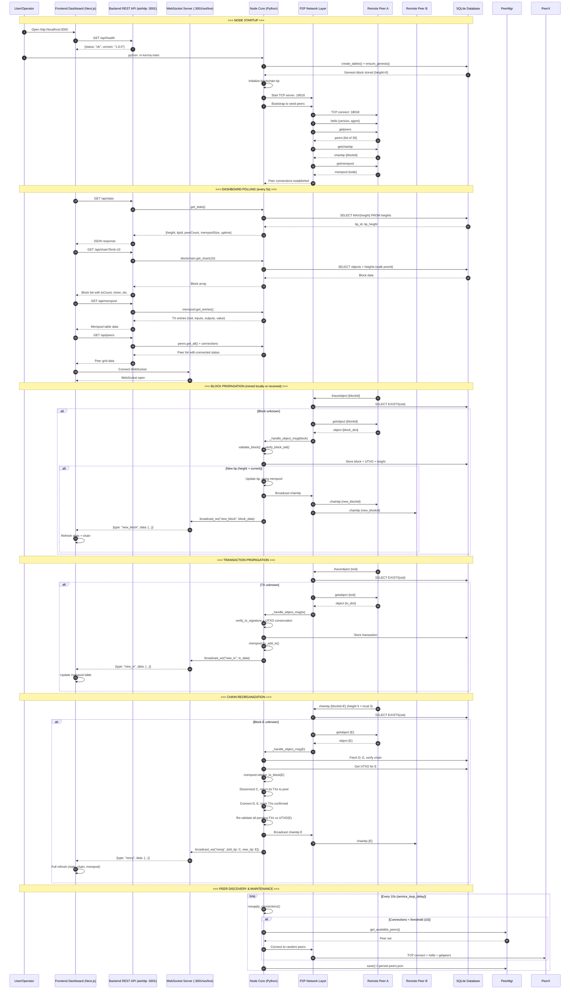
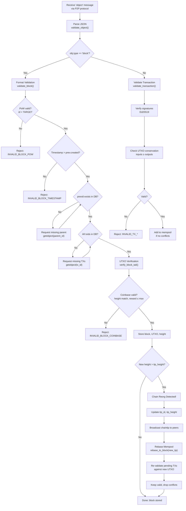
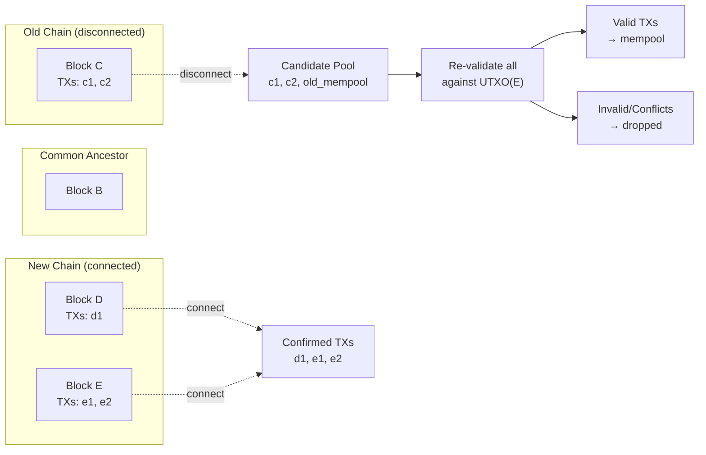

# KermaChain

KermaChain is a Python-based educational blockchain implementing a peer-to-peer cryptocurrency network with the Marabu protocol. It features a blockchain node, REST API, and Next.js dashboard for real-time monitoring, demonstrating Proof-of-Work, UTXO, digital signatures, block validation, and decentralized networking.

---

## Author
**Abdullah Al Mamun**  
M.Sc. & B.Sc. in Software Engineering  
TU Wien (Vienna, Austria) & Daffodil International University  
Email: mamun.swe.de@gmail.com  
GitHub: [github.com/abbysweb](https://github.com/abbysweb)  
ORCID: [0009-0006-7473-0024](https://orcid.org/0009-0006-7473-0024)

---

## Architecture Overview



---

## System Sequence Diagram

The following sequence diagram shows the complete flow from node startup through P2P handshake, block propagation, chain reorganization, and real-time dashboard updates.



---

## Project Structure

---

## Protocol: Marabu

### Message Types
| Message | Direction | Purpose |
|---------|-----------|---------|
| `hello` | Both | Handshake with version + agent |
| `getpeers` / `peers` | Both | Peer discovery (max 30) |
| `getchaintip` / `chaintip` | Both | Chain tip synchronization |
| `getmempool` / `mempool` | Both | Mempool synchronization |
| `getobject` / `object` | Both | Block/Transaction exchange |
| `ihaveobject` | Both | Object advertisement |
| `error` | Both | Error reporting |

### Block Structure
```json
{
  "type": "block",
  "txids": ["..."],
  "nonce": "0000...",
  "previd": "0000...",
  "created": 1671062400,
  "T": "0000abc000000000000000000000000000000000000000000000000000000000",
  "miner": "MinerName",
  "note": "Optional human-readable note"
}
```

### Transaction Structure
```json
{
  "type": "transaction",
  "inputs": [
    { "sig": "...", "outpoint": { "txid": "...", "index": 0 } }
  ],
  "outputs": [
    { "pubkey": "...", "value": 1000000 }
  ]
}
```
Coinbase transactions have `"height": N` instead of inputs.

---

## Quick Start

### Prerequisites
- Python 3.11+
- Node.js 18+
- SQLite3

### 1. Core Node (Python)
```bash
pip install -r requirements.txt
python -m kerma.main
# Or with custom address/port:
python -m kerma.main 0.0.0.0 18018
```

### 2. Backend API Server
```bash
cd backend
pip install -r requirements.txt
python -m kerma.main
# API: http://localhost:3001
# P2P: 0.0.0.0:18018
```

### 3. Frontend Dashboard
```bash
cd frontend
npm install
npm run dev
# Dashboard: http://localhost:3000
```

### 4. Docker
```bash
docker-compose up -d
```

---

## API Endpoints

| Endpoint | Description |
|----------|-------------|
| `GET /api/health` | Health check |
| `GET /api/stats` | Chain height, tip, peers, mempool, uptime |
| `GET /api/chain?limit=50` | Recent blocks |
| `GET /api/blocks/{id}` | Block details |
| `GET /api/mempool` | Pending transactions |
| `GET /api/peers` | Known peers + connection status |
| `GET /api/objects/{id}` | Raw block/transaction |
| `WS /ws/live` | Real-time updates |

---

## Data Flow

### Block Validation Pipeline



### Mempool Rebase on Reorg



---

## Testing

```bash
# Run all integration tests (requires running node on port 18018)
python -m pytest tests/ -v

# Test coverage:
# - Handshake, getchaintip, getpeers, getmempool
# - Block validation: PoW, timestamps, genesis, parent blocks
```

---

## Configuration

### Core (`kerma/constants.py`)
```python
PORT = 18018
BLOCK_TARGET = "0000abc000000000000000000000000000000000000000000000000000000000"
BLOCK_REWARD = 50_000_000_000_000  # 50 TMC (12 decimals)
GENESIS_BLOCK_ID = "00002fa163c7dab0991544424b9fd302bb1782b185e5a3bbdf12afb758e57dee"
```

### Backend (`backend/kerma/config.py`)
Environment variables:
- `KERMA_PORT` (default: 18018)
- `KERMA_API_PORT` (default: 3001)
- `KERMA_DB` (default: `db.db` in project root)

### Frontend
- `NEXT_PUBLIC_API_URL` (default: `http://localhost:3001`)

---

## Tutorial: Blockchain for Complete Beginners

This section explains KermaChain in plain English — no computer science degree required.

### What Is a Blockchain, Really?

Imagine a **shared Google Sheet** that everyone can see, but **nobody can edit past rows**. Every few minutes, a new row gets added with recent transactions. Once added, it's permanent.

That's a blockchain:
- **Blocks** = rows in the spreadsheet
- **Chain** = each row references the previous one (so you can't change history)
- **Nodes** = computers running this software, all keeping identical copies

### What Is KermaChain?

KermaChain is a **teaching blockchain** — a simplified but real implementation of a cryptocurrency network. It demonstrates all the core concepts:
- Peer-to-peer networking (nodes talk directly, no central server)
- Digital signatures (Ed25519 — same math used by Signal, SSH, Solana)
- Proof-of-Work mining (find a rare hash, like a lottery)
- UTXO model (track unspent coins, not account balances)
- Chain reorganizations (when two miners find blocks simultaneously)

It's built for **learning**, not production use.

---

### The Three Pieces You'll Run

```
┌─────────────────────────────────────────────────────────────┐
│  1. CORE NODE (Python)           │  2. API SERVER (Python)  │
│  kerma/main.py                   │  backend/kerma/main.py   │
│  - Connects to other nodes       │  - REST API on :3001     │
│  - Validates blocks/transactions │  - WebSocket for live UI │
│  - Stores data in SQLite         │  - Reads from SQLite     │
└─────────────────────────────────────────────────────────────┘
                              │
                              ▼
                    ┌─────────────────────┐
                    │ 3. DASHBOARD (JS)   │
                    │ frontend/           │
                    │ - Next.js on :3000  │
                    │ - Calls API + WS    │
                    └─────────────────────┘
```

You can run just the **core node** (headless, for testing), or all three for the full visual experience.

---

### Step-by-Step: Run Everything Locally

#### Prerequisites
- **Python 3.11+** — `python --version`
- **Node.js 18+** — `node --version`
- **Git** — `git --version`

#### 1. Clone & Install
```bash
git clone https://github.com/abbysweb/KermaChain.git
cd KermaChain
```

#### 2. Run the Core Node (Terminal 1)
```bash
# Install Python deps
pip install -r requirements.txt
# cryptography, that's it — we use stdlib for everything else

# Start the P2P node on port 18018
python -m kerma.main
```
You'll see:
```
Starting KermaChain node...
  P2P: 0.0.0.0:18018
  API: 0.0.0.0:3001
Blockchain initialized at height 0, tip 00002fa1...
Listening on 0.0.0.0:18018
```

#### 3. Run the API Server (Terminal 2)
```bash
cd backend
pip install -r requirements.txt
# aiohttp, cryptography

python -m kerma.main
```
This starts the REST API on `http://localhost:3001` and WebSocket on `ws://localhost:3001/ws/live`.

#### 4. Run the Dashboard (Terminal 3)
```bash
cd frontend
npm install
npm run dev
```
Open **http://localhost:3000** — you'll see the live dashboard.

---

### What You'll See on the Dashboard

| Section | What It Shows |
|---------|---------------|
| **Stat Cards** | Chain height, connected peers, mempool size, uptime |
| **Height Chart** | Visual timeline of blocks |
| **Recent Blocks** | Each block: height, miner, tx count, timestamp |
| **Mempool** | Pending transactions waiting to be mined |
| **Peers** | Known nodes, green = connected |
| **Explainer** | Click to expand — animated step diagram |

The dashboard **polls the API every 5 seconds** and listens on WebSocket for instant updates when a new block or transaction arrives.

---

### Key Concepts Explained

#### 1. UTXO (Unspent Transaction Output) — "Digital Cash"
Unlike a bank (account model: "Alice has $100"), Bitcoin/KermaChain uses **UTXO**:
- You don't have a balance. You have **discrete coins**.
- Transaction: "I spend coin #A123 and #B456, create new coins #C789 (to Bob) and #D012 (change to me)"
- Prevents double-spending: each coin can only be spent once

#### 2. Ed25519 Signatures — "Unforgeable ID"
Every transaction input must be signed by the private key matching the output's public key. The math (elliptic curve) makes it **impossible to forge** without the private key.

#### 3. Proof-of-Work — "The Lottery"
To add a block, you must find a **nonce** (random number) such that:
```
hash(block_data + nonce) < TARGET
```
The target is a very small number (starts with many zeros). This takes millions of tries — **work** that proves you spent compute power.

#### 4. Chain Reorganization — "The Fork"
Two miners find valid blocks at the same height. Network splits temporarily. When the next block arrives, **longest chain wins**. The losing block's transactions go back to the mempool.

#### 5. Mempool — "Waiting Room"
Valid transactions sit here until a miner includes them in a block. On reorg, they're re-validated against the new chain tip.

---

### Project Structure — What's Where?

```
KermaChain/
├── kerma/                    # CORE NODE (run this for headless)
│   ├── main.py              # Entry point, connection handling
│   ├── constants.py         # Genesis block, ports, targets
│   ├── objects.py           # Block/TX validation, UTXO, signatures
│   ├── mempool.py           # Transaction pool + reorg rebasing
│   ├── validator.py         # Pending object tracker (timeouts)
│   ├── network/
│   │   ├── protocol.py      # Message building/parsing
│   │   ├── peer.py          # Peer address class
│   │   ├── peers.py         # Peer persistence (peers.json)
│   │   └── exceptions.py    # Faulty vs non-faulty errors
│   └── storage/
│       ├── db.py            # SQLite schema + genesis init
│       └── jcs.py           # JSON Canonicalization (RFC 8785)
│
├── backend/                  # API SERVER
│   └── kerma/
│       ├── main.py          # aiohttp server entry
│       ├── config.py        # Dataclass config
│       ├── api/server.py    # REST + WebSocket routes
│       ├── core/            # Block, TX, Blockchain, Mempool, UTXO
│       ├── network/         # Async node, peer manager
│       ├── storage/         # Database wrapper
│       └── crypto/          # Hashing, JCS, Ed25519 verify
│
├── frontend/                 # DASHBOARD (Next.js 14 + TS)
│   ├── app/page.tsx         # Main dashboard
│   ├── components/          # StatCard, BlockCard, HeightChart, etc.
│   └── lib/                 # API client, WebSocket hook, types
│
├── tests/                    # Integration tests (pytest)
│   ├── test_full.py         # Handshake, getchaintip, peers, mempool
│   └── test_transactions.py # Block validation: PoW, timestamps, genesis
│
└── README.md                # You are here
```

---

### Running the Tests

Requires the **core node running on port 18018** (Terminal 1 above):

```bash
python -m pytest tests/ -v
```

Tests cover:
- Handshake + basic RPC (getchaintip, getpeers, getmempool)
- Block validation: invalid PoW, future timestamp, fake genesis, missing parent

---

### Common Issues

| Problem | Fix |
|---------|-----|
| `Address already in use` | Kill old process: `taskkill /PID <pid> /F` (Windows) or `lsof -ti:18018 \| xargs kill` (Mac/Linux) |
| Frontend shows mock data | Ensure API server (Terminal 2) is running on :3001 |
| `ModuleNotFoundError: kerma` | Run from project root, or `pip install -e .` |
| WebSocket fails in browser | Check CORS — API allows all origins by default |

---

### Next Steps for Learning

1. **Read the code** — Start with `kerma/objects.py` (validation logic)
2. **Add a feature** — Try implementing a simple mining endpoint
3. **Break things** — Send malformed blocks via the tests, see how validation catches them
4. **Scale up** — Run multiple nodes on different ports, watch them sync

---

### Why "KermaChain"?

**Kerma** = "Kernel" + "Karma" — the core engine of actions and consequences in a blockchain.

---

## Genesis Block Explained

The genesis block is hardcoded in `kerma/constants.py` and `backend/kerma/config.py`:

```json
{
  "T": "0000abc000000000000000000000000000000000000000000000000000000000",
  "created": 1671062400,  // Dec 13, 2022 — NYT fusion breakthrough
  "miner": "Marabu",
  "nonce": "00000000000000000000000000000000000000000000000000000000005bb0f2",
  "note": "The New York Times 2022-12-13: Scientists Achieve Nuclear Fusion Breakthrough With Blast of 192 Lasers",
  "previd": null,
  "txids": [],
  "type": "block"
}
```

- **Timestamp** (`1671062400`) = Dec 13, 2022 00:00:00 UTC — the day NYT reported a nuclear fusion net-energy-gain breakthrough
- **Target** (`T`) = Same as all blocks (`0000abc...`) — genesis must also satisfy PoW
- **Nonce** = Pre-computed so genesis hashes below target
- **Note** = Immutable historical marker (like Bitcoin's "Chancellor on brink of second bailout")

---

## UTXO Walkthrough (Visual)

UTXO = **Unspent Transaction Output** — think of it as physical cash bills, not a bank balance.

```
┌─────────────────────────────────────────────────────────────────┐
│ BLOCK 1: Coinbase (miner reward)                                │
│   TX: coinbase_abc  →  Output #0: 50 TMC to Miner's pubkey     │
│   UTXO SET: { "coinbase_abc#0": 50_000_000_000_000 }           │
└─────────────────────────────────────────────────────────────────┘
                              │
                              ▼
┌─────────────────────────────────────────────────────────────────┐
│ BLOCK 2: Miner sends 20 TMC to Alice                           │
│   TX: spend_tx_123                                             │
│     Input:  coinbase_abc#0 (50 TMC) signed by Miner            │
│     Output #0: 20 TMC to Alice's pubkey                        │
│     Output #1: 30 TMC change back to Miner                     │
│   UTXO SET:                                                    │
│     { "spend_tx_123#0": 20_000_000_000_000,    // Alice        │
│       "spend_tx_123#1": 30_000_000_000_000 }   // Miner change  │
└─────────────────────────────────────────────────────────────────┘
                              │
                              ▼
┌─────────────────────────────────────────────────────────────────┐
│ BLOCK 3: Alice sends 5 TMC to Bob                              │
│   TX: alice_to_bob_456                                         │
│     Input:  spend_tx_123#0 (20 TMC) signed by Alice            │
│     Output #0: 5 TMC to Bob's pubkey                           │
│     Output #1: 15 TMC change back to Alice                     │
│   UTXO SET:                                                    │
│     { "spend_tx_123#1": 30_000_000_000_000,    // Miner        │
│       "alice_to_bob_456#0": 5_000_000_000_000,  // Bob         │
│       "alice_to_bob_456#1": 15_000_000_000_000 } // Alice       │
└─────────────────────────────────────────────────────────────────┘
```

**Key rules:**
- Each UTXO can only be spent **once** (prevents double-spending)
- Inputs must reference **existing, unspent** UTXOs
- Sum(inputs) ≥ Sum(outputs) — difference = miner fee
- Coinbase TX has no inputs, creates new coins (block reward + fees)

---

## Simple Miner Example

KermaChain doesn't include a built-in miner — you write one! Here's a minimal CPU miner:

```python
# scripts/simple_miner.py
# Run: python scripts/simple_miner.py <miner_pubkey_hex>

import sys
import hashlib
import json
import time
import requests

from kerma.crypto.jcs import canonicalize
from kerma.crypto.hashing import get_objid

TARGET = "0000abc000000000000000000000000000000000000000000000000000000000"
TARGET_INT = int(TARGET, 16)
API = "http://localhost:3001"

def fetch_mempool():
    r = requests.get(f"{API}/api/mempool")
    return r.json()

def fetch_chaintip():
    r = requests.get(f"{API}/api/stats")
    return r.json()["tipId"]

def build_block(miner_pubkey, prev_block_id, txids):
    # Coinbase: reward + fees go to miner
    coinbase = {
        "type": "transaction",
        "height": 0,  # will be set after we know height
        "outputs": [{"pubkey": miner_pubkey, "value": 50_000_000_000_000}]
    }
    coinbase_id = get_objid(coinbase)
    
    block = {
        "type": "block",
        "txids": [coinbase_id] + txids,
        "previd": prev_block_id,
        "created": int(time.time()),
        "T": TARGET,
        "miner": "SimpleMiner",
        "nonce": "0" * 64
    }
    return block, coinbase

def mine_block(block):
    nonce = 0
    while True:
        block["nonce"] = f"{nonce:064x}"
        block_id = get_objid(block)
        if int(block_id, 16) < TARGET_INT:
            return block, block_id
        nonce += 1
        if nonce % 100000 == 0:
            print(f"  tried {nonce} nonces...")

def main():
    if len(sys.argv) < 2:
        print("Usage: python simple_miner.py <miner_pubkey_hex>")
        sys.exit(1)
    
    miner_pubkey = sys.argv[1]
    print(f"Mining as {miner_pubkey[:16]}...")
    
    while True:
        tip = fetch_chaintip()
        mempool = fetch_mempool()
        txids = [tx["txid"] for tx in mempool]
        
        print(f"Tip: {tip[:8]}... | Mempool: {len(txids)} txs")
        
        block, coinbase = build_block(miner_pubkey, tip, txids)
        
        # Get height from tip
        r = requests.get(f"{API}/api/blocks/{tip}")
        if r.ok:
            height = r.json()["height"]
            coinbase["height"] = height + 1
            # Recalculate coinbase ID with correct height
            block["txids"][0] = get_objid(coinbase)
        
        print("Mining...")
        mined_block, block_id = mine_block(block)
        print(f"Found block: {block_id[:16]}... (nonce={mined_block['nonce'][:16]}...)")
        
        # Submit via P2P would require raw socket — here we just show the block
        print(json.dumps(mined_block, indent=2))
        
        # In reality: broadcast via P2P protocol (ihaveobject → getobject → object)

if __name__ == "__main__":
    main()
```

**To mine:**
1. Generate a keypair: `python -c "from cryptography.hazmat.primitives.asymmetric.ed25519 import Ed25519PrivateKey; k=Ed25519PrivateKey.generate(); print('pub:', k.public_key().public_bytes_raw().hex()); print('priv:', k.private_bytes_raw().hex())"`
2. Run miner: `python scripts/simple_miner.py <pubkey>`
3. When block found, submit via P2P (requires implementing `ihaveobject`/`object` messages)

---

## WebSocket Events Reference

The WebSocket endpoint exists at `ws://localhost:3001/ws/live` but **currently no events are broadcast** — the `broadcast_ws()` method is implemented but never called. This is a good first contribution.

**Planned events (when implemented):**

| Event | Payload | Triggered When |
|-------|---------|----------------|
| `new_block` | `{height, blockid, txCount, miner, timestamp}` | New chain tip accepted (local or from peer) |
| `new_tx` | `{txid, inputs, outputs, totalValue}` | Valid TX added to mempool |
| `reorg` | `{old_tip, new_tip, disconnected, connected}` | Chain reorganization completed |
| `peer_update` | `{host, port, connected, connectedSince}` | Peer connects or disconnects |

**Frontend usage (TypeScript):**
```typescript
ws.onmessage = (event) => {
  const { type, data } = JSON.parse(event.data);
  switch (type) {
    case "new_block":
      refreshStats(); refreshChain(); break;
    case "new_tx":
      refreshMempool(); break;
    case "reorg":
      fullRefresh(); break;
    case "peer_update":
      refreshPeers(); break;
  }
};
```

> **Note:** The frontend currently polls REST endpoints every 5s. WebSocket support would eliminate this polling.

---

## Security Model

| ✅ Implemented | ❌ Not Implemented (Educational Only) |
|----------------|---------------------------------------|
| Ed25519 signature verification | DoS protection / rate limiting |
| UTXO conservation (no inflation) | P2P encryption (plain TCP) |
| PoW validation (anti-spam) | Sybil resistance (no identity) |
| Timestamp ordering (no time travel) | Economic incentives (no real value) |
| Coinbase maturity (height check) | Consensus finality (probabilistic) |
| Chain reorg handling | Checkpointing / finality gadgets |
| Faulty/non-faulty error separation | Pruning / archival modes |

**Assumptions:**
- All nodes run honest code
- Network latency < block time
- Majority hashpower is honest (standard PoW assumption)
- No adversarial peer flooding

---

## Performance Notes

| Metric | Approximate | Notes |
|--------|-------------|-------|
| Block validation | 1-5 ms | Single-threaded, crypto-heavy |
| TX validation | 0.5-2 ms | Ed25519 verify dominates |
| Mempool rebase | 5-50 ms | Proportional to mempool size |
| Sync speed | ~100 blocks/sec | Local LAN, depends on disk I/O |
| DB size | ~1 KB/block | SQLite, no compression |
| Memory | 50-200 MB | Python + DB cache |

**Bottlenecks:**
1. Single-threaded asyncio event loop
2. SQLite synchronous writes
3. Ed25519 verification per input
4. Full UTXO copy on reorg

---

## Extending KermaChain

### Easy (Good First Issues)
- [ ] Add `/api/block/:id/transactions` endpoint (expand txids)
- [ ] Add `/api/transaction/:id` endpoint
- [ ] Implement difficulty retargeting (every 2016 blocks)
- [ ] Add fee-rate mempool sorting
- [ ] WebSocket: add `stats` broadcast on each block

### Medium
- [ ] P2P encryption (Noise protocol)
- [ ] Peer reputation / ban scoring
- [ ] Block relay optimization (compact blocks)
- [ ] SQLite WAL mode + connection pooling
- [ ] Prometheus metrics endpoint

### Advanced
- [ ] Light client (SPV) with Merkle proofs
- [ ] Consensus finality gadget (e.g., Casper-like)
- [ ] Sharding / parallel validation
- [ ] Hardware wallet integration (Ledger/Trezor)

---

## License

MIT License - See LICENSE file for details.
