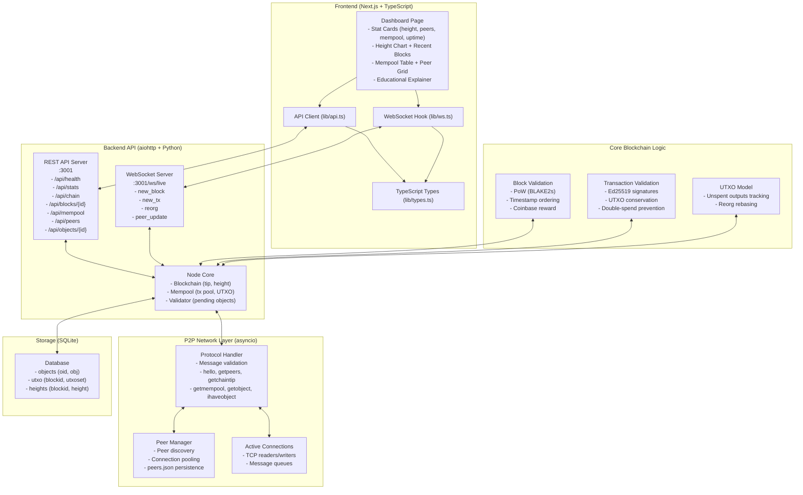
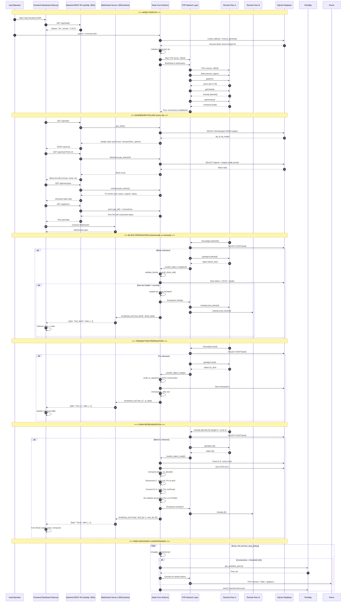
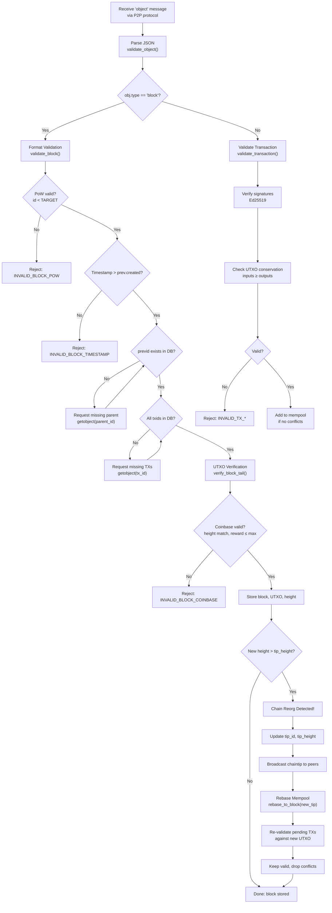
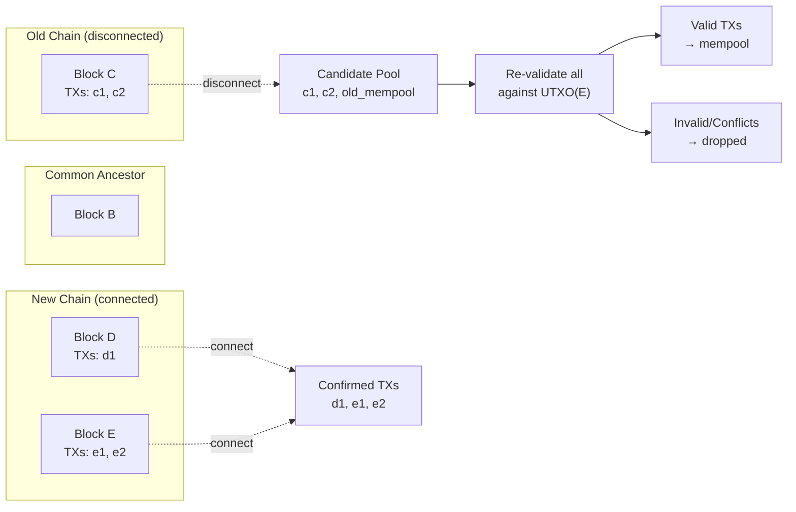

# KermaChain

A Python P2P blockchain node implementing the Marabu protocol, built as a consolidated project from a series of cryptocurrency assignments. Features a modern Next.js + TypeScript dashboard for real-time monitoring.

---

## Author
**Abdullah Al Mamun**  
M.Sc. & B.Sc. in Software Engineering  
TU Wien (Vienna, Austria) & Daffodil International University  
Email: mamun.swe.de@gmail.com  
GitHub: [github.com/abbysweb](https://github.com/abbysweb)  
ORCID: [0009-0006-7473-0024](https://orcid.org/0009-0006-7473-0024)

---

## Architecture Overview



---

## System Sequence Diagram

The following sequence diagram shows the complete flow from node startup through P2P handshake, block propagation, chain reorganization, and real-time dashboard updates.



---

## Project Structure

---

## Protocol: Marabu

### Message Types
| Message | Direction | Purpose |
|---------|-----------|---------|
| `hello` | Both | Handshake with version + agent |
| `getpeers` / `peers` | Both | Peer discovery (max 30) |
| `getchaintip` / `chaintip` | Both | Chain tip synchronization |
| `getmempool` / `mempool` | Both | Mempool synchronization |
| `getobject` / `object` | Both | Block/Transaction exchange |
| `ihaveobject` | Both | Object advertisement |
| `error` | Both | Error reporting |

### Block Structure
```json
{
  "type": "block",
  "txids": ["..."],
  "nonce": "0000...",
  "previd": "0000...",
  "created": 1671062400,
  "T": "0000abc000000000000000000000000000000000000000000000000000000000",
  "miner": "MinerName",
  "note": "Optional human-readable note"
}
```

### Transaction Structure
```json
{
  "type": "transaction",
  "inputs": [
    { "sig": "...", "outpoint": { "txid": "...", "index": 0 } }
  ],
  "outputs": [
    { "pubkey": "...", "value": 1000000 }
  ]
}
```
Coinbase transactions have `"height": N` instead of inputs.

---

## Quick Start

### Prerequisites
- Python 3.11+
- Node.js 18+
- SQLite3

### 1. Core Node (Python)
```bash
pip install -r requirements.txt
python -m kerma.main
# Or with custom address/port:
python -m kerma.main 0.0.0.0 18018
```

### 2. Backend API Server
```bash
cd backend
pip install -r requirements.txt
python -m kerma.main
# API: http://localhost:3001
# P2P: 0.0.0.0:18018
```

### 3. Frontend Dashboard
```bash
cd frontend
npm install
npm run dev
# Dashboard: http://localhost:3000
```

### 4. Docker
```bash
docker-compose up -d
```

---

## API Endpoints

| Endpoint | Description |
|----------|-------------|
| `GET /api/health` | Health check |
| `GET /api/stats` | Chain height, tip, peers, mempool, uptime |
| `GET /api/chain?limit=50` | Recent blocks |
| `GET /api/blocks/{id}` | Block details |
| `GET /api/mempool` | Pending transactions |
| `GET /api/peers` | Known peers + connection status |
| `GET /api/objects/{id}` | Raw block/transaction |
| `WS /ws/live` | Real-time updates |

---

## Data Flow

### Block Validation Pipeline



### Mempool Rebase on Reorg



---

## Testing

```bash
# Run all integration tests (requires running node on port 18018)
python -m pytest tests/ -v

# Test coverage:
# - Handshake, getchaintip, getpeers, getmempool
# - Block validation: PoW, timestamps, genesis, parent blocks
```

---

## Configuration

### Core (`kerma/constants.py`)
```python
PORT = 18018
BLOCK_TARGET = "0000abc000000000000000000000000000000000000000000000000000000000"
BLOCK_REWARD = 50_000_000_000_000  # 50 TMC (12 decimals)
GENESIS_BLOCK_ID = "00002fa163c7dab0991544424b9fd302bb1782b185e5a3bbdf12afb758e57dee"
```

### Backend (`backend/kerma/config.py`)
Environment variables:
- `KERMA_PORT` (default: 18018)
- `KERMA_API_PORT` (default: 3001)
- `KERMA_DB` (default: `db.db` in project root)

### Frontend
- `NEXT_PUBLIC_API_URL` (default: `http://localhost:3001`)

---

## Development History

See [`docs/`](docs/) for the assignment progression:
- `001-initial-merge.md` - Initial consolidation
- `002-oop-refactor.md` - Object-oriented refactor

---

## License

MIT License - See LICENSE file for details.